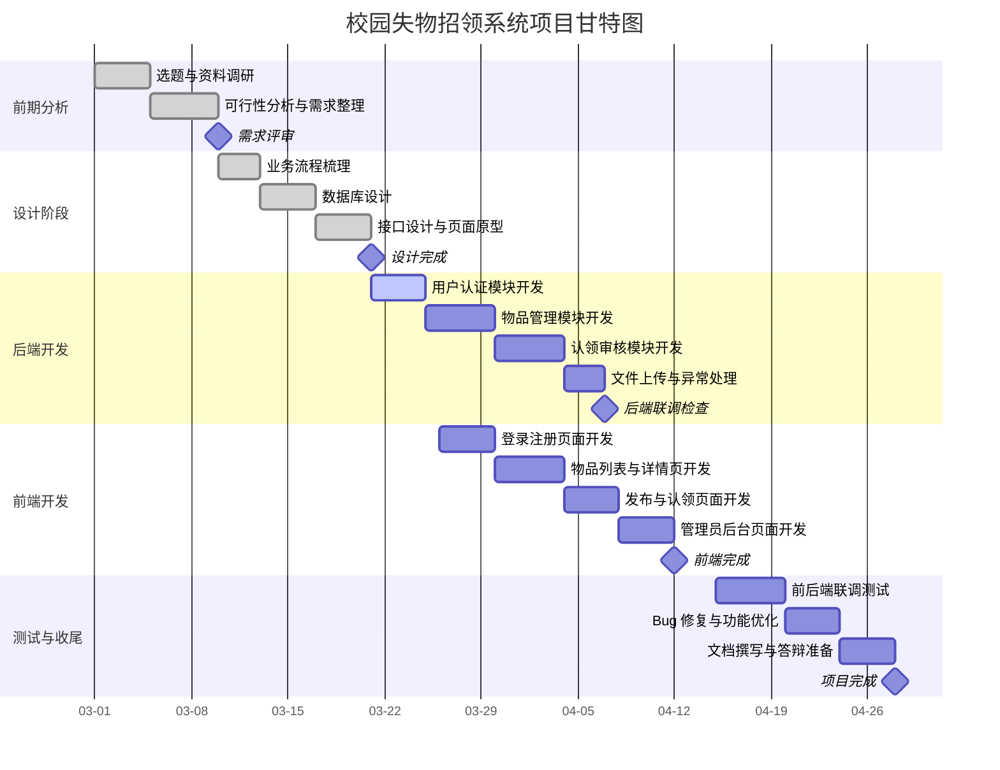
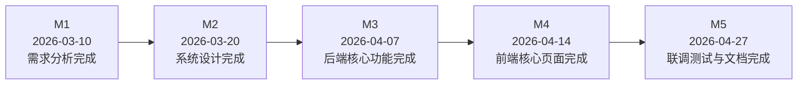

# 校园失物招领系统实验报告

## 一、项目概述

### 1.1 项目名称

校园失物招领系统（LostLink）

### 1.2 项目研究目的

在高校日常学习和生活中，学生遗失校园卡、钥匙、耳机、书本、钱包等物品的情况比较常见。传统的失物招领方式主要依赖微信群、朋友圈、宿舍群、公告栏或线下登记，这种方式存在信息分散、检索效率低、认领过程不规范、责任边界不清晰等问题。基于这一背景，本项目设计并实现一个面向校园场景的失物招领系统，希望通过信息化手段提高失物发布、查找、认领和审核的效率。

本项目的研究目的主要体现在以下几个方面。第一，结合软件工程课程所学知识，完成一个具有实际应用场景的小型信息管理系统，从而加深对需求分析、系统设计、数据库建模、前后端开发和项目管理的理解。第二，通过实现“发布信息-提交认领-管理员审核-状态闭环”的业务流程，探索如何将现实场景中的事务处理转化为清晰的软件功能模块。第三，在工程实践中锻炼前后端分离开发能力，掌握 `Spring Boot + MyBatis + MySQL + Vue 3` 技术栈的综合应用方法。

### 1.3 项目主要内容

本项目采用前后端分离架构，后端使用 `Java 17`、`Spring Boot`、`MyBatis` 和 `MySQL`，前端使用 `Vue 3`、`Vite`、`Pinia`、`Vue Router` 和 `Axios`。系统围绕校园失物招领场景，设计并实现了以下主要内容：

1. 用户注册、登录与身份认证功能。
2. 失物信息和招领信息的发布、分类、分页查询与详情查看功能。
3. 用户上传物品图片、认领证明图片的文件管理功能。
4. 用户对目标物品发起认领申请并填写认领说明的功能。
5. 管理员对认领记录进行审核，并在审核通过后自动更新物品状态的功能。
6. 管理员仪表板统计功能，用于展示用户数、物品数、认领数及分类分布情况。

从课程实验角度看，本项目不仅完成了基础的 CRUD 功能，还加入了角色区分、业务流程控制、状态流转和图片上传等功能，因此比单纯的信息展示类项目更具有完整性和实践价值。

## 二、项目可行性和需求分析报告

### 2.1 项目可行性分析

#### 2.1.1 技术可行性

本项目所采用的技术栈较为成熟，开发资料丰富，适合软件工程专业本科生在课程实验中使用。后端 `Spring Boot` 能够快速构建 RESTful API，`MyBatis` 便于完成数据库访问，`MySQL` 适合处理中小规模结构化数据；前端 `Vue 3` 框架轻量、组件化程度高，适合快速搭建交互界面。项目的整体复杂度适中，既包含完整业务流程，又没有超出个人或小组课程设计的实现能力，因此技术上可行。

#### 2.1.2 经济可行性

本项目属于课程实验项目，开发和运行成本较低。开发工具可以使用免费软件，如 IntelliJ IDEA 社区版、VS Code、Node.js、Maven、MySQL 社区版等；部署阶段可以直接在个人电脑本地运行，也可以选择低成本云服务器进行演示。因此，该项目不需要较高的经费投入，具有较好的经济可行性。

#### 2.1.3 运行可行性

系统面向普通学生和管理员使用，核心操作流程清晰，页面功能集中，用户只需通过浏览器即可完成登录、发布信息、上传图片、认领申请和审核管理等操作。对于课程实验或校园内部小范围试用来说，系统具备较好的可操作性和运行可行性。

#### 2.1.4 进度可行性

从开发任务来看，本项目可以划分为需求分析、数据库设计、后端接口开发、前端页面开发、联调测试和文档整理等阶段。每个阶段目标较明确，工作量适中，适合在 6 至 8 周的课程设计周期内完成，因此在进度安排上也是可行的。

### 2.2 需求分析

#### 2.2.1 业务需求分析

校园失物招领业务的核心问题不是单纯“发布一条信息”，而是如何建立一套能够支撑后续认领和审核的闭环流程。系统需要解决以下实际问题：失主如何快速找到相关物品，拾取者如何规范发布信息，认领者如何提交证明材料，管理员如何判断认领是否合理，以及系统如何记录每个阶段的处理状态。

基于上述场景，本项目将系统用户划分为普通用户和管理员两类。普通用户主要负责注册登录、发布物品信息、查看物品详情、提交认领申请、查看自己发布的物品和自己的认领记录；管理员主要负责查看认领记录、审核认领申请以及查看系统统计数据。

#### 2.2.2 功能需求分析

系统的功能需求可以概括为以下几个模块：

1. 用户模块：实现注册、登录、个人身份获取等功能。
2. 物品模块：实现失物/招领信息的新增、列表展示、分页查询、按关键字和分类筛选、详情查看、发布者关闭或重新开放物品状态等功能。
3. 认领模块：实现认领申请提交、认领说明填写、证明图片上传、认领记录查询和管理员审核等功能。
4. 文件模块：实现物品图片和认领证明图片上传，限制文件大小和文件类型。
5. 管理模块：实现管理员统计看板、待审核认领记录查看以及通过/拒绝审批操作。

#### 2.2.3 非功能需求分析

除了功能需求外，系统还需要满足一定的非功能需求。第一，易用性方面，界面应该尽量简洁，支持用户快速完成主要操作。第二，安全性方面，系统需要具备基本的登录校验、角色控制和文件上传限制，避免未登录用户越权操作。第三，性能方面，系统应能支持一般课程实验规模下的并发访问和分页查询。第四，可维护性方面，项目应尽量采用模块化结构，将前端页面、后端控制器、数据访问层和公共配置分开，便于后续修改和扩展。

### 2.3 技术分析

本项目采用典型的前后端分离方案。前端通过 `Axios` 请求后端 REST API，并结合 `Pinia` 维护登录状态，通过 `Vue Router` 控制页面跳转和路由权限；后端负责处理业务逻辑、认证拦截、数据访问和异常返回。数据库层采用三张核心表：`user_account`、`lost_item` 和 `claim_record`，分别对应用户、物品和认领记录，结构清晰，便于理解和实现。

在认证实现上，系统采用基于 Token 的简化会话机制：用户登录成功后，后端生成 token 并保存到内存，前端将 token 保存在本地存储中，请求时通过 `Authorization` 请求头携带。该方案实现简单，适合课程实验环境，但也存在服务器重启后 token 失效、不适合分布式部署等局限。文件存储方面，项目采用本地目录 `uploads/` 保存图片资源，配合后端静态资源映射实现访问，降低了实现门槛。

### 2.4 风险分析

虽然本项目整体可行，但在实际开发和运行中仍然存在以下风险：

1. 技术风险：前后端联调时容易出现接口字段不一致、跨域访问、时间格式转换等问题。
2. 安全风险：当前系统使用内存保存会话 token，安全性和持久化能力有限；文件上传虽然限制了类型和大小，但仍需要进一步防范恶意文件伪装。
3. 数据风险：认领证明主要依赖用户提交的文字和图片，系统难以完全自动判断信息真伪，仍需要管理员人工审核。
4. 进度风险：对于大三学生而言，同时完成后端、前端、数据库和文档工作，时间安排稍有不当就可能影响整体进度。
5. 扩展风险：如果后续希望支持消息通知、智能匹配、微信小程序接入或高并发部署，现有架构仍需要进一步优化。

针对上述风险，可以采取如下措施：统一接口文档和命名规范；在关键功能开发后及时联调；对上传文件做更严格校验；为重要业务流程增加状态判断；在项目初期合理拆分任务和安排里程碑。

### 2.5 国内外研究现状

从国内应用情况看，校园失物招领类系统多数围绕“信息发布”和“基础管理”展开，常见形式包括网站、小程序、校园公众号和校内服务平台。很多课程设计或毕业设计项目采用 `SSM`、`Spring Boot`、`Vue`、小程序等技术实现基础功能，但其中不少系统更偏向公告板式展示，认领审核流程和证据管理相对薄弱。

从国外类似应用的思路看，失物招领服务通常更强调平台化和流程化管理，例如与校园门户、社区服务平台、邮件通知系统或位置服务结合，重视用户隐私保护、移动端体验和信息检索效率。一些平台会进一步结合标签管理、地点定位、图片辅助识别等方式提高匹配效率。

总体来看，国内外相关系统的发展趋势都是从“分散发布”逐步走向“统一平台管理”，从“静态信息展示”走向“流程闭环处理”。本项目虽然不涉及复杂算法，但通过引入角色划分、认领证明提交、管理员审核和状态流转等机制，较好地贴合了这一发展方向。

## 三、创新点与项目特色

### 3.1 项目创新点

本项目的创新点更多体现在业务流程整合和工程实现层面，而不是算法层面的原创突破，这也比较符合本科阶段课程实验的实际水平。

第一，系统不是简单地实现“失物信息发布”，而是构建了“物品发布-认领申请-管理员审核-状态更新”的闭环业务流程。与很多只停留在信息展示和留言功能的课程设计项目相比，本项目更接近真实校园管理场景。

第二，系统支持认领证明图片上传和文字说明结合的认领方式。这样既保留了信息化处理的便利性，也为管理员审核提供了更直观的依据，提高了认领处理的规范性。

第三，系统实现了用户角色区分和权限控制。普通用户与管理员在菜单访问、数据查看和操作范围上存在明确差异，这使系统具备了基本的权限管理思想。

第四，系统设置了物品状态与认领状态的联动机制。当某一条认领申请被审核通过后，相关物品自动进入 `MATCHED` 状态，同时其他待审核记录可以被统一处理，从而保证业务数据的一致性。

### 3.2 项目特色

本项目的特色主要体现在以下几个方面：

1. 贴近校园实际需求，选题具有现实意义，容易理解和展示。
2. 采用前后端分离架构，工程结构相对规范，便于后续扩展。
3. 覆盖注册登录、发布、查询、上传、认领、审核、统计等多个完整模块。
4. 实现难度适中，既有一定挑战，也符合大三学生独立完成或小组协作完成的能力范围。
5. 具有较好的演示效果，适合作为课程设计、实验答辩或项目展示案例。

### 3.3 项目预期成果

本项目的预期成果包括：

1. 一个可运行的校园失物招领系统原型，支持前后端联动。
2. 一套较完整的数据库表结构及初始化数据。
3. 一组可供调用的后端 RESTful API。
4. 一个具备基本交互能力的 Web 前端界面。
5. 一份项目设计说明书、实验报告及相关图表文档。

## 四、项目设计说明书

### 4.1 项目拟解决问题的技术路线

本项目的技术路线可以概括为“需求分析驱动业务建模，数据库结构支撑核心流程，后端接口实现规则控制，前端界面完成用户交互，最后通过联调测试保证系统可运行”。

具体来说，首先根据校园失物招领场景提炼出用户、物品和认领三类核心对象，并围绕这三类对象建立数据库模型。其次，在后端使用 `Spring Boot` 搭建 API 服务，使用拦截器实现登录校验和管理员权限控制，使用 `MyBatis` 编写 SQL 完成数据访问。然后，在前端使用 `Vue 3` 构建页面，结合路由守卫控制页面访问权限，利用 `Pinia` 保存登录用户信息，完成从界面到接口的数据交互。最后，通过前后端联调验证发布物品、提交认领和管理员审核等关键业务流程。

### 4.2 系统总体设计

系统总体上采用三层思路进行设计：

1. 表现层：前端页面负责数据展示、表单提交、状态提示和用户交互。
2. 业务层：后端控制器负责请求分发、参数校验、权限控制、业务规则处理和统一返回。
3. 数据层：MyBatis Mapper 负责与 MySQL 数据库交互，实现增删改查和统计查询。

这种设计方式层次较清晰，有利于降低模块间耦合度，也更符合软件工程课程中“模块化设计”的要求。

### 4.3 数据库设计

系统数据库主要由三张核心表组成：

1. `user_account`：保存用户账号、密码、真实姓名、联系电话、角色等信息。
2. `lost_item`：保存物品标题、描述、分类、地点、时间、联系人、物品类型、发布者和状态等信息。
3. `claim_record`：保存认领人、认领原因、证明说明、证明图片、审核状态、审核备注等信息。

这三张表之间形成了较清晰的业务关系：一个用户可以发布多个物品，也可以提交多个认领记录；一个物品可以对应多条认领申请；管理员对认领记录进行审核后，会影响物品的最终状态。整体数据库结构能够较好支撑本系统的核心功能。

### 4.4 软件功能设计

#### 4.4.1 用户与认证功能设计

用户可以进行注册和登录。注册时需要填写用户名、密码、真实姓名和电话；登录成功后系统返回 token，前端将其保存到本地。后端通过拦截器解析 `Authorization` 头中的 Bearer Token，识别当前用户身份，并根据接口上的登录要求或管理员要求判断是否放行。

#### 4.4.2 物品管理功能设计

用户可以发布失物信息或招领信息，填写标题、描述、分类、地点、时间、联系方式并上传图片。系统支持物品列表分页展示，并可以按关键字、物品类型、状态和分类进行筛选。发布者可以查看自己发布的物品，并对物品执行关闭或重新开放操作。

#### 4.4.3 认领管理功能设计

认领管理是本项目的核心功能之一。普通用户在查看物品详情时，可以提交认领原因和证明描述，并上传若干证明图片。系统会校验物品是否仍处于开放状态、认领人是否为发布者本人、是否已经存在重复待审核记录，从而避免无效提交。

管理员可以查看全部认领记录或待审核认领记录，对其执行“通过”或“拒绝”操作。若某条认领申请通过，系统会将对应物品状态修改为已匹配，并对其他相关记录做联动处理，以保证流程的完整性。

#### 4.4.4 文件上传功能设计

系统提供图片上传接口，支持物品图片和认领证明图片的上传。为了控制风险，后端对上传文件进行了基本限制，包括文件大小不能超过 5MB、文件类型必须为图片、扩展名需要在允许列表内。文件上传成功后返回可访问的 URL，供前端页面展示。

#### 4.4.5 管理员统计功能设计

管理员进入后台后，可以查看系统统计数据，如用户总数、物品总数、开放物品数、匹配成功数、关闭物品数、认领申请总数、待审核数及按类别统计数据等。该功能可以帮助管理员从整体上掌握系统运行情况，也增强了项目演示时的数据可视化效果。

### 4.5 系统优点与不足

本系统的优点在于：功能流程相对完整，业务场景明确，前后端结构清晰，易于扩展，适合作为软件工程课程实验项目。与此同时，本系统也存在一些不足：认证机制较为简化，会话信息保存在内存中；文件存储采用本地磁盘，不适合大规模部署；尚未接入短信、邮件、消息提醒等通知机制；自动化测试和部署能力仍较弱。这些不足也为后续优化提供了方向。

## 五、项目计划进度安排

下面给出一个按 8 周课程设计周期规划的项目甘特图和里程碑图。实际开发时可以根据小组人数和课程安排进行调整。

### 5.1 项目甘特图 Mermaid 代码

### 5.2 项目里程碑图 Mermaid 代码

### 5.3 图表解释说明

从甘特图可以看出，项目整体遵循“先分析、再设计、后开发、最后测试与文档整理”的软件工程基本流程。前期重点是明确需求和业务流程，中期重点是实现后端和前端核心模块，后期重点是联调、修复问题和整理文档。这种安排的优点在于每个阶段目标明确，便于检查进度，也有利于在出现延期时及时调整。

从里程碑图可以看出，项目中最关键的节点共有五个：需求分析完成、系统设计完成、后端核心功能完成、前端核心页面完成以及联调与文档完成。设置这些里程碑的意义在于帮助开发者判断项目是否按计划推进，避免到了最后阶段才发现整体进度滞后。对于课程实验项目来说，里程碑管理虽然不如大型软件项目复杂，但同样能够提高开发的条理性。

## 六、项目成本管理

### 6.1 成本构成分析

由于本项目属于课程实验项目，其成本主要不是商业化的人力和硬件采购成本，而是学习成本、时间成本和少量运行成本。项目中使用的主要开发框架和工具均为开源或免费版本，因此软件采购成本接近于零。若系统仅在本地运行演示，则服务器成本也可以忽略；若需要部署到云服务器进行展示，则会产生少量租赁费用。

### 6.2 项目预算经费安排

下面给出一个较为合理的课程实验预算估算表：

| 成本项目 | 预算金额（元） | 说明 |
| --- | ---: | --- |
| 开发工具与软件 | 0 | 使用开源框架和免费开发工具 |
| 本地开发设备 | 0 | 使用个人已有电脑 |
| 数据库与运行环境 | 0 | 本地部署 MySQL、JDK、Node.js |
| 云服务器演示费用 | 120 | 若租用 1 个月轻量服务器用于展示 |
| 网络与测试杂费 | 50 | 测试、截图、资料整理等 |
| 打印与文档装订 | 30 | 实验报告打印、装订 |
| 风险预留经费 | 100 | 处理临时需求或环境问题 |
| 合计 | 300 | 适合学生课程项目的低成本预算 |

### 6.3 成本控制思路

本项目的成本控制思路主要有三点。第一，尽量使用成熟的开源技术，减少学习和采购成本。第二，优先本地开发和测试，只有在需要线上展示时才考虑低成本部署。第三，合理安排开发顺序，先完成核心功能，再逐步完善附加功能，以避免因为过度追求复杂效果而投入过多时间和精力。

## 七、总结

通过本次校园失物招领系统的设计与实现，我对软件工程课程中“需求分析、系统设计、编码实现、测试联调、文档撰写”的完整开发流程有了更直观的认识。以往在课堂上学习这些内容时，更多是从概念和理论层面理解，而在本项目中，我需要真正把一个现实问题抽象为业务流程，再进一步拆分为数据结构、接口设计和页面交互，这让我体会到软件开发并不是简单写代码，而是一个需要不断分析、权衡和验证的工程过程。

在技术实践方面，我较系统地训练了前后端分离开发能力。后端部分让我进一步掌握了 `Spring Boot` 接口开发、参数校验、拦截器鉴权、MyBatis 数据访问等内容；前端部分让我熟悉了 `Vue 3` 组件开发、路由控制、状态管理和接口联调。尤其是在处理认领审核、状态联动、文件上传等功能时，我认识到业务逻辑往往比页面本身更重要，只有把规则设计清楚，系统才能真正稳定运行。

当然，本项目也暴露了我在工程实现方面的一些不足。例如，认证方案还比较简单，缺少持久化会话支持；系统测试主要依赖手工测试，自动化测试覆盖不足；在可扩展性和安全性方面，仍有很多可以继续完善的地方。但正是这些问题，让我更加明确了后续学习的方向。总体来看，这次实验不仅提升了我的编码能力，也增强了我从整体视角理解软件项目的能力，对今后参加更复杂的课程设计、竞赛项目和实习开发都有较大帮助。

